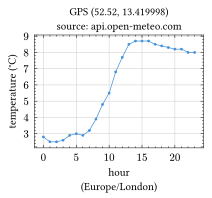
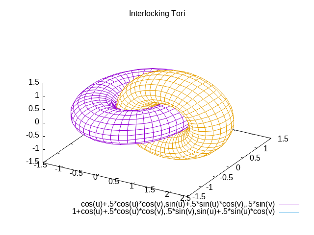

```
                                \\\///
                               / _  _ \
                             (| (.)(.) |)
      .--------------------.OOOo--()--oOOO.-------------------.
      |                                                       |
      |         _____    __     _    __             __        |
      |        / ___/   / /_   (_)  / /_   _____   / /_       |
      |        \__ \   / __/  / /  / __/  / ___/  / __ \      |
      |       ___/ /  / /_   / /  / /_   / /__   / / / /      |
      |      /____/   \__/  /_/   \__/   \___/  /_/ /_/       |
      |                                                       |
      |                                                       |
      '-------------------.oooO-------------------------------'
                           (   )   Oooo.
                            \ (    (   )
                             \_)    ) /
                                   (_/
```

  
  
  

## A pandoc lua-filter, turning codeblocks into works of art

If you can generate output (be it text or graphics) from the command
line, stitch will help you do the same from within a codeblock and
include its result upon converting the document using
[pandoc](https://pandoc.org/).

## Security

`stitch.lua` is, like any lua-filter that executes codeblocks, totally
insecure and any CISO’s nightmare. Before running an externally supplied
document through the `stitch.lua` filter, be sure you have vetted each
and every codeblock that is marked for stitching since it probably runs
a pletora of system commands on your machine, potentially causing chaos
and/or harm.

## Examples

A few examples, mostly taken from the repo’s of the command line tools
used. Each work of ‘art’ is followed by the codeblock that generated it.
Most examples use a configuration section `stitch=tool_name` in order to
minimize the clutter in a codeblock’s attributes. See the
[documentation](#documentation) section for how to configure `Stitch`.

See the other
[examples](https://github.com/hertogp/stitch/tree/main/examples) which
also contain some information on installing the command line tools used.

### [Diagon](https://github.com/ArthurSonzogni/Diagon)

If you were there for the dawn of the Internet, you might appreciate the
simplicity of ascii output.

```
┌─────────┐                                           
│CodeBlock│                                           
└────┬────┘                                           
  ___▽___       ____     ┌──────────────┐             
 ╱       ╲     ╱    ╲    │cbx, art, out,│             
╱ stitch? ╲___╱ exe? ╲___│err created   │             
╲         ╱yes╲      ╱yes└───────┬──────┘             
 ╲_______╱     ╲____╱            │                    
     │no         │no             │                    
     │           └───┬───────────┘                    
     │             __▽___                             
     │            ╱      ╲    ┌────────────────┐      
     │           ╱ purge? ╲___│remove old files│      
     │           ╲        ╱yes└────────┬───────┘      
     │            ╲______╱             │              
     │               │no               │              
     │               └────┬────────────┘              
     │           ┌────────▽───────┐                   
     │           │parse inc-option│                   
     │           └────────┬───────┘                   
     │              ______▽______     ┌──────────────┐
     │             ╱             ╲    │include in the│
     │            ╱ inc: part(s)? ╲___│order parsed  │
     │            ╲               ╱yes└───────┬──────┘
     │             ╲_____________╱            │       
     │                    │no                 │       
     └──────────┬─────────┴───────────────────┘       
           ┌────▽───┐                                 
           │CONTINUE│                                 
           └────────┘                                 

```

````
``` {#cb01 stitch="diagon" arg="Flowchart"}
"CodeBlock"

if ("stitch?") {
  if ("exe?") {
    "cbx, art, out, err created"
  }
  if ("purge?") {
    "remove old files"
  }
  "parse inc-option"
  if("inc: part(s)?") {
    "include in the order parsed"
  }
}

"CONTINUE"
```
````

### [youplot](https://github.com/red-data-tools/YouPlot)

Or a bit more dynamic: today’s local temperature (well, at the last time
of compiling this readme anyway). The codeblock pulls in a csv file from
`api.open-meteo.com`, cuts the output down to what is needed and
modifies the first field keeping only the hours of the day. That output
is then processed by
[youplot](https://github.com/red-data-tools/YouPlot)

```
                  Temperature (˚C) Today
         ┌                                        ┐ 
   00:00 ┤■■■■■■■■■■■■■■■■■■■■■■■■■■ 9.5            
   01:00 ┤■■■■■■■■■■■■■■■■■■■■■■■■■■ 9.4            
   02:00 ┤■■■■■■■■■■■■■■■■■■■■■■■■■■■ 9.6           
   03:00 ┤■■■■■■■■■■■■■■■■■■■■■■■■■■ 9.5            
   04:00 ┤■■■■■■■■■■■■■■■■■■■■■■■■■■ 9.5            
   05:00 ┤■■■■■■■■■■■■■■■■■■■■■■■■■ 9.1             
   06:00 ┤■■■■■■■■■■■■■■■■■■■■■■■■■■ 9.3            
   07:00 ┤■■■■■■■■■■■■■■■■■■■■■■■■■■■ 9.6           
   08:00 ┤■■■■■■■■■■■■■■■■■■■■■■■■■■■ 9.9           
   09:00 ┤■■■■■■■■■■■■■■■■■■■■■■■■■■■■■ 10.5        
   10:00 ┤■■■■■■■■■■■■■■■■■■■■■■■■■■■■■■ 10.9       
   11:00 ┤■■■■■■■■■■■■■■■■■■■■■■■■■■■■■■■■ 11.4     
   12:00 ┤■■■■■■■■■■■■■■■■■■■■■■■■■■■■■■■■■ 12.1    
   13:00 ┤■■■■■■■■■■■■■■■■■■■■■■■■■■■■■■■■■■ 12.3   
   14:00 ┤■■■■■■■■■■■■■■■■■■■■■■■■■■■■■■■■■■ 12.3   
   15:00 ┤■■■■■■■■■■■■■■■■■■■■■■■■■■■■■■■■■ 12.1    
   16:00 ┤■■■■■■■■■■■■■■■■■■■■■■■■■■■■■■■■ 11.7     
   17:00 ┤■■■■■■■■■■■■■■■■■■■■■■■■■■■■■■ 10.9       
   18:00 ┤■■■■■■■■■■■■■■■■■■■■■■■■■■■■ 10.2         
   19:00 ┤■■■■■■■■■■■■■■■■■■■■■■■■■■■■ 10.1         
   20:00 ┤■■■■■■■■■■■■■■■■■■■■■■■■■■■ 9.8           
   21:00 ┤■■■■■■■■■■■■■■■■■■■■■■■■■■■■ 10.0         
   22:00 ┤■■■■■■■■■■■■■■■■■■■■■■■■■■■■ 10.1         
   23:00 ┤■■■■■■■■■■■■■■■■■■■■■■■■■■■■ 10.3         
   00:00 ┤■■■■■■■■■■■■■■■■■■■■■■■■■■■■ 10.2         
         └                                        ┘ 
```

````
``` {#cb02 stitch="youplot"}
curl -sL 'https://api.open-meteo.com/v1/forecast?'\
'latitude=52.52&longitude=13.41&hourly=temperature_2m&format=csv' \
| head -n 29 | tail -n +5 | sed 's/^[^T]*T//' \
|  uplot bar -d, -t "Temperature (˚C) Today" -o
```
````

### [Cetz](https://typst.app/universe/package/cetz)

Or go more graphical with
[Cetz](https://typst.app/universe/package/cetz), one of many packages in
the [typst](https://typst.app/universe/search/?kind=packages) universe
for plotting, charts & tree layout.

<figure id="cb03-1-art" data-stitch="cetz"
data-caption="Karl&#39;s picture">

<figcaption>Karl's picture</figcaption>
</figure>

````
``` {#cb03 stitch="cetz" caption="Karl's picture"}
#import "@preview/cetz:0.4.2"
#set page(width: auto, height: auto, margin: .5cm)
#show math.equation: block.with(fill: white, inset: 1pt)
#cetz.canvas(length: 3cm, {
  import cetz.draw: *
  set-style(
    mark: (fill: black, scale: 2),
    stroke: (thickness: 0.4pt, cap: "round"),
    angle: (
      radius: 0.3,
      label-radius: .22,
      fill: green.lighten(80%),
      stroke: (paint: green.darken(50%))
    ), content: (padding: 1pt)
  )
  grid((-1.5, -1.5), (1.4, 1.4), step: 0.5, stroke: gray + 0.2pt)
  circle((0,0), radius: 1)
  line((-1.5, 0), (1.5, 0), mark: (end: "stealth"))
  content((), $ x $, anchor: "west")
  line((0, -1.5), (0, 1.5), mark: (end: "stealth"))
  content((), $ y $, anchor: "south")
  for (x, ct) in ((-1, $ -1 $), (-0.5, $ -1/2 $), (1, $ 1 $)) {
    line((x, 3pt), (x, -3pt))
    content((), anchor: "north", ct)
  }
  for (y, ct) in ((-1, $ -1 $), (-0.5, $ -1/2 $), (0.5, $ 1/2 $), (1, $ 1 $)) {
    line((3pt, y), (-3pt, y))
    content((), anchor: "east", ct)
  }
  // Draw the green angle
  cetz.angle.angle((0,0), (1,0), (1, calc.tan(30deg)),
    label: text(green, [#sym.alpha]))
  line((0,0), (1, calc.tan(30deg)))
  set-style(stroke: (thickness: 1.2pt))
  line((30deg, 1), ((), "|-", (0,0)), stroke: (paint: red), name: "sin")
  content(("sin.start", 50%, "sin.end"), text(red)[$ sin alpha $])
  line("sin.end", (0,0), stroke: (paint: blue), name: "cos")
  content(("cos.start", 50%, "cos.end"), text(blue)[$ cos alpha $], anchor: "north")
  line((1, 0), (1, calc.tan(30deg)), name: "tan", stroke: (paint: orange))
  content("tan.end", $ text(#orange, tan alpha) = text(#red, sin alpha) / text(#blue, cos alpha) $, anchor: "west")
})
```
````

### [Fletcher](https://typst.app/universe/package/fletcher)

Another package from the [typst](https://typst.app/) universe, for
drawing diagrams and arrows. Revisiting the flowchart shown earlier with
[diagon](#diagon).

<figure id="cb04-1-art" data-stitch="cetz" data-caption="Stitch">

<figcaption>Stitch</figcaption>
</figure>

````
``` {#cb04 stitch="cetz" caption="Stitch" fmt="svg"}
#import "@preview/fletcher:0.5.8" as fletcher: diagram, node, edge
#import fletcher.shapes: pill, parallelogram, diamond
#set page(width: auto, height: auto, margin: (x: 8pt, y: 8pt))
#set text(10pt)
#diagram(
  node-stroke: .1em,
  node-fill: gradient.radial(blue.lighten(80%), blue, center: (30%, 20%), radius: 80%),
  spacing: 4em,
  mark-scale: 150%,
  node((-1,-1), "codeblock", name: <cb>, shape: pill),
  node((-1,0), "stitch?", name: <stitch>, shape: diamond),
  edge(<cb>, <stitch>, "-|>"),
  node((0,0), "exe?", name: <exe>, shape: diamond),
  edge(<stitch>, <exe>, "-|>", `yes`),
  node((1,0), "create: cbx art out err", name: <create>, shape: parallelogram, extrude: (-2.5, 0)),
  edge(<exe>, <create>, "->", `yes`),
  node((0,1), "purge?", name: <purge>, shape:diamond),
  edge(<exe>, <purge>, "-|>", `no`),
  edge(<create.south>, (1, 0.5), (0, 0.5),  "-|>"),
  node((1,1), "rm old files", name: <rm>, shape: parallelogram, extrude: (-2.5,0)),
  edge(<purge>, <rm>, "-|>", `yes`),
  node((0,2), "parse `inc`-opt", name: <parse>, shape: parallelogram),
  edge(<purge>, <parse>, "-|>", `no`),
  edge(<rm.south>, (1, 1.5), (0,1.5), "-|>"),
  node((0,3), "`inc:`-parts?", name: <parts>, shape: diamond),
  edge(<parse>, <parts>, "-|>"),
  node((1,3), "include in order parsed", name: <include>, shape: parallelogram),
  edge(<parts>, <include>, "-|>", `yes`),
  node((-1,4), "continue", name: <continue>, shape: pill),
  edge(<stitch>, <continue>, "-|>", `no`),
  edge(<parts>, (0, 3.45), (-1, 3.45), "-|>", `no`),
  edge(<include>, (1, 4), <continue>, "-|>"),
)
```
````

### [Lilaq](https://lilaq.org/)

Yet another [typst](https://typst.app/) package, this time for advanced
data visualization. Unfortunately, typst and its packages currently have
no way of downloading data, so the following codeblock is used for
side-effects only (well, its included here to show it’s actually there
and doing something)

````
``` {#cb05 stitch="download" arg="local-temperature.json"}
curl -sL 'https://api.open-meteo.com/v1/forecast?latitude=52.52&longitude=13.41&'\
'hourly=temperature_2m&timezone=Europe%2FLondon&forecast_days=1&format=json'\
| jq .
```
````

This downloads today’s temperature to
`.stitch/cetz/local-temperature.json`, which is then used in the
following codeblock to create a graph.

<figure id="cb06-1-art" data-stitch="cetz"
data-caption="Temperature (C) today by Lilaq">

<figcaption>Temperature (C) today by Lilaq</figcaption>
</figure>

````
``` {#cb06 stitch="cetz" caption="Temperature (C) today by Lilaq" fmt="svg" exe="yes"}
#import "@preview/lilaq:0.5.0" as lq
#set page(width: auto, height: auto, margin: (x: 8pt, y: 8pt))
#let dta = json("local-temperature.json")
#let hour(str) = {
    return int(str.slice(11, count: 2))
}
#let hours = dta.hourly.time.map(hour)

#lq.diagram(
  title: [GPS (#dta.latitude, #dta.longitude)\ source: api.open-meteo.com],
  xlabel: [hour\ (#dta.timezone)],
  ylabel: [temperature (#dta.hourly_units.temperature_2m)],
  lq.plot(hours, dta.hourly.temperature_2m),
)
```
````

### [Gnuplot](https://gnuplot.sourceforge.net)

Another example using the trusty `gnuplot`.

<figure id="cb07-1-art" data-stitch="gnuplot">

</figure>

````
``` {#cb07 stitch="gnuplot"}
set terminal png
set dummy u,v
set key bmargin center horizontal Right noreverse enhanced autotitles nobox
set parametric
set view 50, 30, 1, 1
set isosamples 50, 20
set hidden3d back offset 1 trianglepattern 3 undefined 1 altdiagonal bentover
set ticslevel 0
set title "Interlocking Tori"
set urange [ -3.14159 : 3.14159 ] noreverse nowriteback
set vrange [ -3.14159 : 3.14159 ] noreverse nowriteback
splot cos(u)+.5*cos(u)*cos(v),sin(u)+.5*sin(u)*cos(v),.5*sin(v) with lines,\
1+cos(u)+.5*cos(u)*cos(v),.5*sin(v),sin(u)+.5*sin(u)*cos(v) with lines
```
````

## Documentation

This lua-filter requires pandoc version \>= 2.19. Some stuff in here is
probably not Windows friendly, but any \*nix should be fine.

### Installation

Installation is pretty straightforward:

- put `stitch.lua` on your `$LUA_PATH` (e.g. in
  `~/.local/share/pandoc/filters`)
- add `~/.local/share/pandoc/filters/?.lua` to `$LUA_PATH`

### Usage

`% pandoc --lua-filter stitch.lua doc.md -t doc.pdf`

A doc’s meta section is read by Stitch for options. When converting
multiple documents into one output document, those could go into a yaml
file mentioned last on the command line. Or as the first one, since meta
information is merged, where the ‘last one wins’.

*stitchable codeblock*

A codeblock can be marked for processing by `stitch` by:

- `.stitch` included as a class, and/or
- `stitch=name` included as an attribute

If either one is found, the codeblock will be processed according to the
set of options found for this codeblock. See [Options](#options) below
for the resolution order.

Using `stitch=` or `stitch=""` is the same as including the `.stitch`
class. If the hardcoded defaults are enough, simply add `.stitch` as a
class. If the tool being used requires other settings, create a `name`’d
section in the meta block of the document and set the codeblock
attribute `stitch=name`.

Examples:

    ```{#id-x .stitch}
    echo "just using the defaults"
    ```

or

    ```{#id-y stitch=download out="#dir/dta/weather.json"}
    curl -sL https://host/v1/forecast/?today&format=json
    ```

and the meta section looks something like this:

    ---
    author: me
    stitch:
      defaults:
        dir: ".stitch"     # work dir for all things stitch
      download:
        inc=""             # no includes, just download
        cmd="#cbx 1>#out"  # redirect stdout to file given by cb's `#out`-attribute
    ...

The `#<opt>`’s are expanded by stitch using the option-set for the
current codeblock. In case of the second codeblock example, stdout is
redirected to `.stitch/dta/weather.json` which is a path relative to the
directory where the pandoc conversion command was given.

*codeblock ‘execution’*

Processing a codeblock follows these steps:

1.  resolve all options and expand them (once)
2.  save `cb.text` to file given by `#cbx`-path (always)
3.  check if anything has changed (1+ of the other artifacts exist)
4.  conditionally run `os.execute(#cmd)` to produce new artifacts
5.  check for old files and conditionally remove them
6.  parse the `inc` option and include results in order (if any)

In the face of errors, just complain and carry on.

### Features

Stitch provides a few features that make converting codeblocks easy:

- conditional codeblock execution
- organize file storage locations for codeblock artifacts
- old file detection and (possibly) clean up
- include 0 or more of stdout, stderr, output file and/or codeblock
- include the same output multiple times in different ways
- run codeblock as system command or run it through another command
- use a codeblock for side-effects only (0 includes)
- different log levels to show processing details
- non-stitch cb attributes are transferred to included results if
  possible
- unique id is also assigned and transferred if possible

### Options

Stitch options are resolved in the following, most to least, specific
order:

1.  codeblock attributes
2.  a meta `name` section
3.  the meta `defaults` section
4.  hardcoded Stitch defaults

The list of options and default valuesi are:

| Opt | Value                               | Description                                      |
|:----|:------------------------------------|:-------------------------------------------------|
| arg | ’’                                  | argument for the command line                    |
| cid | ‘x’                                 | the codeblock’s id, if absent it is generated    |
| dir | ‘.stitch’                           | Stitch’s working directory, relative to pandoc’s |
| exe | ‘maybe’                             | execute codeblock (or not)                       |
| fmt | ‘png’                               | intended graphic file format                     |
| log | ‘info’                              | log verbosity                                    |
| old | ‘purge’                             | what to do with old residual files               |
| inc | ‘cbx:fcb out art:img err’           | what to include in which order                   |
| —   | — expandables —                     | —                                                |
| cbx | ‘\#dir/#cid-#sha.cbx’               | codeblock file template                          |
| out | ‘\#dir/#cid-#sha.out’               | stdout file capture template                     |
| err | ‘\#dir/#cid-#sha.err’               | stderr file capture template                     |
| art | ‘\#dir/#cid-#sha.#fmt’              | cmd file output template                         |
| cmd | ‘\#cbx \#arg \#art 1\>#out 2\>#err’ | command line template                            |

Table Stitch options

#### cid

**cid** is a unique, codeblock identifier, used in file templates.

It is set to either:

- cb.attr.identifier, or
- cb\<nth\>, where it’s the nth codeblock seen by stitch

When generating an element `id` to assign to included elements,
`id=cid-nth-what` is used, where `nth` is the nth directive of the
`inc`-option being inserted and the `what` is the part being included
(one of `cbx`, `out`, `err` or `art`).

So `csv-3-err` is the id for the element inserted for a codeblock
with:  
- identifier `csv`, and  
- where the 3rd directive in its `inc` option includes an artifact and
where  
- `err` is the artificat to be included

#### arg

**arg** is used to optionally supply extra argument(s) on the command
line.

It is a string and may contain spaces and it is simply interpolated in
the `cmd` expansion which will be executed via an `os.execute(cmd)`. So
`arg=""` won’t show up on the command line.

The example below shows how a bash script sees its arguments when the
`#arg` is a multi word string in the codeblock’s attributes. There is no
output on stderr so the redirect does not create a file and the output
file argument is ignored by the script.

```` stitched
``` {#arg .stitch inc="cbx:fcb out" arg="two words"}
#!/usr/bin/env bash
echo "--------------"
echo "script name  :  ${0}"
echo "nr of args   :  ${#}"
echo "all args     :  ${@}"
echo "1st arg      :  ${1}"
echo "2nd arg      :  ${2}"
echo "last arg     :  ${@: -1}"
echo "alt last arg :  ${@:$#}"
echo "--------------"
```
````

``` stitched
--------------
script name  :  .stitch/readme/arg-7a81194509fcf053f3169313eb42278109c48801.cbx
nr of args   :  3
all args     :  two words .stitch/readme/arg-7a81194509fcf053f3169313eb42278109c48801.png
1st arg      :  two
2nd arg      :  words
last arg     :  .stitch/readme/arg-7a81194509fcf053f3169313eb42278109c48801.png
alt last arg :  .stitch/readme/arg-7a81194509fcf053f3169313eb42278109c48801.png
--------------
```

#### dir

**dir** is used in the expansion of the artifact filepaths.

This effectively sets the working directory for stitch relative to the
directory where pandoc was started. Override the hardcoded `.stitch`
default in one or more of:

- `meta.stitch.defaults.dir`, to change it for all codeblocks
- `meta.stitch.name.dir`, to override for all codeblocks linked to
  `name`
- `cb.attributes.dir`, to override for a specific codeblock

#### exe

**exe** specifies whether a codeblock should actually run.

Valid values are:

- `yes`, always run the codeblock (new or not)
- `no`, do not run the codeblock even if new, rest of processing still
  happens
- `maybe`, run the codeblock if something changed (the default)

Stitch calculates a sha-hash using all option values (sorted by key),
excluding the `exe`’s value plus the codeblock contents and with all
spaces removed. That fingerprint is then used (`#sha`) in filenames and
allows for unique names as well as old/new file detection. Files that
match the path of the current codeblock’s new files, except for the
`-#sha.ext` part, are considered old and candidates for removal (see
**old**).

So if `exe=maybe` and files exists for the newly calculated fingerprint
the codeblock doesn’t run again and previous results will be used
instead.

Swapping `exe` to a different value won’t affect the sha-fingerprint.

#### fmt

**fmt** is used as the extension in the `#art` template.

An easy way to set the intended graphics format on the codeblock level
without touching the `art` template.

#### log

**log** is verbosity of logging, one of
`debug, info, warn, error, silent`.

Use `meta.stitch.defaults.log=silent` and a `cb.attribute.log=debug` to
turn off all logging except for one codeblock where logging happens on
the debug level.

#### old

**old** says what to do with old files during a pandoc conversion run.

If `old=purge`, old files are deleted. Anything else means `keep`.

Old files of an artificat are detected when their filenames match the
new filename except for the last `-#sha.ext` part. If a filename
template doesn’t end in `-#sha.ext` then Stitch cannot detect old files
and manual clean up will be necessary.

#### artifact templates

**cbx, out, err, art** are simply filename templates.

These are primarily used in the `cmd` template during the expansion to
the full command to run on the command line. Depending on how the `cmd`
template is set, these may or may not be actually used.

Usually `out, err` are for redirecting output on stdout and stderr
respectively. Normally, `art` refers to some graphics file (or whatever)
produced by the codeblock or a cli tools called by `cmd`. However, it
can be anything you like, it just provides a way to capture output to
file.

#### cmd

**cmd** is expanded and run via `os.execute(cmd)`.

The (hardcoded) default is to:

- run the codeblock as a system command,
- provide the expanded forms of `#arg` and `#art` as arguments, and
- redirect stdout & stderr to `#out` and `err` respectively.

Ofcourse, it is up to the codeblock code to actually use its argument
and/or the intended output filename.

#### inc

**inc** contains 0 or more directives on what to include and how.

It is a single string containing comma or space separated directives. A
directive must start with the `what` and may be followed by three other
types of mechanisms (in any order) which are defined by their leading
character.

    what!read@filter:how
     |    |     |     `- one of {<none>, fcb, img, fig} - optional
     |    |     `------- mod[.func], filter(s) w/ func to call - optional
     |    `------------- one of the pandoc `from` formats - optional
     `------------------ one of {cbx, art, out, err} - mandatory

     * if a part is omitted, so is its leading marker (`!`, `@` or `:`).
     * `what` must start the directive, the other parts can be in any order

Note that the same artifact can be included multiple times. Regardless
of the order of those 3 mechanisms, they are always evaluated in this
order:

1.  `!read` the artifact’s data using `pandoc.read(data, read)` – if
    applicable
2.  `@filter` the data or doc (if re-read)
3.  `:how` include the result in a specific manner in the master
    document

*what*

This part starts the directive and is the only mandatory part and refers
to:

- `cbx`, the codeblock itself
- `art`, usually contains graphical output (depends on `cmd` used)
- `out`, usually contains the output on stdout (depends on `cmd` used)
- `err`, usually contains the output on stderr (depends on `cmd` used)

*!read*

After the `what`’s output file has been read, `!read` says the data must
be re-read by pandoc using `pandoc.read(data, <read>)`. Note:

- `read`’s value should be one of pandoc’s `-f xx` formats
- `!read` converts the data to a Pandoc document

See [pandoc’s options](https://pandoc.org/MANUAL.html#general-options)
or `% pandoc --list-input-formats` for possible values for `read`. So
something like `!markdown`, `!csv` or some other value on that list.

*@filter*

After the `what` has been read (and possibly reread using pandoc.read),
it can be processed further by listing a filter in the form of
`mod.func`. Stitch will require `mod` which could be a regular module
`mod` exporting `func` or another pandoc-lua filter.

If a module could be loaded which is actually named `mod.func`, then it
is supposed to export a `Pandoc` function. Such a module requires the
data to be an actual Pandoc document produced by `!read`.

However, it could be any module that simply accepts the data as acquired
by reading the `what`-file.

If no module was found an error is logged and processing continues.

*:how*

Specifies how to include the final result (i.e. data or doc) after
reading, re-reading and possibly filtering.

- *\<none\>*, means going with the Stitch default for what is being
  included:
  - data is type `Pandoc` then its blocks are inserted, otherwise:
  - `art` is linked to as an pandoc.Image
  - `out` is included as the body of a pandoc.CodeBlock
  - `err` dito
  - `cbx` is included as a pandoc.CodeBlock
- *fcb*, to include the result in a fenced codeblock
  - if data is a pandoc element -\> cb content =
    `pandoc.write(data, native)`
  - otherwise, data is included as-is in the codeblock contents
- *img*, a pandoc.Image link to the file on disk for `what`
- *fig*, same but using pandoc.Figure

*putting it together*

If you are wondering what the pandoc AST looks like for a snippet the
following codeblock would reveal that when reading some csv-file using
`-f csv`. The attributes say:

- `.stitch` use the defaults for options not specified in these
  attributes
- `exe=no` don’t run the codeblock (`cmd` won’t be executed)
- `inc="cbx:fcb cbx!csv cbx!csv:fcb"`
  - include the codeblock as-is in a new fenced codeblock, including its
    attributes
  - include the codeblock’s data after reading it as pandoc `-f csv`
    format which means the doc’s blocks are inserted
  - same, but put it inside a new fenced codeblock for which the doc is
    first serialized using its `native` output format.

```` stitched
``` {#csv .stitch inc="cbx:fcb cbx!csv cbx!csv:fcb" exe="no"}
opt,value,description
arg, "", cli-argument
exe, maybe, execute
```
````

| opt | value | description  |
|-----|-------|--------------|
| arg |       | cli-argument |
| exe | maybe | execute      |

``` stitched
[ Table
    ( "csv-3-cbx" , [ "stitched" ] , [] )
    (Caption Nothing [])
    [ ( AlignDefault , ColWidthDefault )
    , ( AlignDefault , ColWidthDefault )
    , ( AlignDefault , ColWidthDefault )
    ]
    (TableHead
       ( "" , [] , [] )
       [ Row
           ( "" , [] , [] )
           [ Cell
               ( "" , [] , [] )
               AlignDefault
               (RowSpan 1)
               (ColSpan 1)
               [ Plain [ Str "opt" ] ]
           , Cell
               ( "" , [] , [] )
               AlignDefault
               (RowSpan 1)
               (ColSpan 1)
               [ Plain [ Str "value" ] ]
           , Cell
               ( "" , [] , [] )
               AlignDefault
               (RowSpan 1)
               (ColSpan 1)
               [ Plain [ Str "description" ] ]
           ]
       ])
    [ TableBody
        ( "" , [] , [] )
        (RowHeadColumns 0)
        []
        [ Row
            ( "" , [] , [] )
            [ Cell
                ( "" , [] , [] )
                AlignDefault
                (RowSpan 1)
                (ColSpan 1)
                [ Plain [ Str "arg" ] ]
            , Cell
                ( "" , [] , [] ) AlignDefault (RowSpan 1) (ColSpan 1) []
            , Cell
                ( "" , [] , [] )
                AlignDefault
                (RowSpan 1)
                (ColSpan 1)
                [ Plain [ Str "cli-argument" ] ]
            ]
        , Row
            ( "" , [] , [] )
            [ Cell
                ( "" , [] , [] )
                AlignDefault
                (RowSpan 1)
                (ColSpan 1)
                [ Plain [ Str "exe" ] ]
            , Cell
                ( "" , [] , [] )
                AlignDefault
                (RowSpan 1)
                (ColSpan 1)
                [ Plain [ Str "maybe" ] ]
            , Cell
                ( "" , [] , [] )
                AlignDefault
                (RowSpan 1)
                (ColSpan 1)
                [ Plain [ Str "execute" ] ]
            ]
        ]
    ]
    (TableFoot ( "" , [] , [] ) [])
]
```

As a final example, here’s how to run a codeblock’s output through a
filter after re-reading it as markdown. In this case, the filter is
stitch itself.

````` lua
```` {#nested .lua .stitch inc="cbx:fcb out!markdown@stitch" log="debug" hdr="1"}
#! /usr/bin/env lua

print [[---
author: nested
stitch:
  defaults:
    dir: ".stitch/readme/nested"
...

# Nested report

This could be some report created by a command line tool, producing
a markdown report on some topic.  Here it's just the text as printed
by lua.  Its codeblock's can also be processed by stitch.

```{#redo2 .stitch inc="cbx!csv" log=debug exe=no}
day,count
mon,1
tue,2
```

## The weather today

```{#cb02 .stitch inc="out"}
curl -sL 'https://api.open-meteo.com/v1/forecast?'\
'latitude=52.52&longitude=13.41&hourly=temperature_2m&format=csv' \
| head -n 29 | tail -n +5 | sed 's/^[^T]*T//' \
|  uplot bar -d, -t "Temperature (˚C) Today" -o
```

]]
````
`````

## Nested report

This could be some report created by a command line tool, producing a
markdown report on some topic. Here it’s just the text as printed by
lua. Its codeblock’s can also be processed by stitch.

| day | count |
|-----|-------|
| mon | 1     |
| tue | 2     |

### The weather today

``` stitched
                  Temperature (˚C) Today
         ┌                                        ┐ 
   00:00 ┤■■■■■■■■■■■■■■■■■■■■■■ 5.2                
   01:00 ┤■■■■■■■■■■■■■■■■■■■■■ 4.9                 
   02:00 ┤■■■■■■■■■■■■■■■■■■■■ 4.6                  
   03:00 ┤■■■■■■■■■■■■■■■ 3.4                       
   04:00 ┤■■■■■■■■■■■■ 2.7                          
   05:00 ┤■■■■■■■■■■■■■■■■ 3.6                      
   06:00 ┤■■■■■■■■■■■■■■ 3.2                        
   07:00 ┤■■■■■■■■■■■■■■■ 3.5                       
   08:00 ┤■■■■■■■■■■■■■■■■■■ 4.2                    
   09:00 ┤■■■■■■■■■■■■■■■■■■■■■■■ 5.4               
   10:00 ┤■■■■■■■■■■■■■■■■■■■■■■■■■■■■ 6.5          
   11:00 ┤■■■■■■■■■■■■■■■■■■■■■■■■■■■■■■■ 7.1       
   12:00 ┤■■■■■■■■■■■■■■■■■■■■■■■■■■■■■■■■ 7.3      
   13:00 ┤■■■■■■■■■■■■■■■■■■■■■■■■■■■■■■■■■■ 7.9    
   14:00 ┤■■■■■■■■■■■■■■■■■■■■■■■■■■■■■■■■■■■ 8.1   
   15:00 ┤■■■■■■■■■■■■■■■■■■■■■■■■■■■■■■■■■■ 7.9    
   16:00 ┤■■■■■■■■■■■■■■■■■■■■■■■■■■■■■■ 7.0        
   17:00 ┤■■■■■■■■■■■■■■■■■■■■■■■■■■■■ 6.5          
   18:00 ┤■■■■■■■■■■■■■■■■■■■■■■■■■ 5.8             
   19:00 ┤■■■■■■■■■■■■■■■■■■■■■■■■ 5.5              
   20:00 ┤■■■■■■■■■■■■■■■■■■■■■■ 5.1                
   21:00 ┤■■■■■■■■■■■■■■■■■■■■ 4.7                  
   22:00 ┤■■■■■■■■■■■■■■■■■■ 4.1                    
   23:00 ┤■■■■■■■■■■■■■■■■ 3.7                      
   00:00 ┤■■■■■■■■■■■■■■ 3.2                        
         └                                        ┘ 
```
