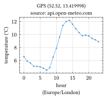

``` boxes
                                \\\///
                               / _  _ \
                             (| (.)(.) |)
      .--------------------.OOOo--()--oOOO.-------------------.
      |                                                       |
      |         _____    __     _    __             __        |
      |        / ___/   / /_   (_)  / /_   _____   / /_       |
      |        \__ \   / __/  / /  / __/  / ___/  / __ \      |
      |       ___/ /  / /_   / /  / /_   / /__   / / / /      |
      |      /____/   \__/  /_/   \__/   \___/  /_/ /_/       |
      |                                                       |
      |                  - a lua-filter -                     |
      |                                                       |
      '-------------------.oooO-------------------------------'
                           (   )   Oooo.
                            \ (    (   )
                             \_)    ) /
                                   (_/
```

  
  
  

# Turn codeblocks into works of art

If you can generate output (be it text or graphics) from the command
line, stitch will help you do the same from within a codeblock and
include its result upon converting the document using
[pandoc](https://pandoc.org/).

The main features of this lua-filter include:

- run a codeblock as a system command to produce `data`
- or use the codeblock itself (its text) as `data`
- optionally have pandoc read the `data` to convert it to a pandoc `doc`
- optionally run the `data` or `doc` through another lua program
- include 0 or more results (as image, figure, codeblock or doc
  fragment)

See [features](#features) for a more complete list.

## Security

`stitch.lua` is, like any lua-filter that executes codeblocks, totally
*insecure* and any CISO’s nightmare. Before running an externally
supplied document through the `stitch.lua` filter, be sure you have
vetted each and every codeblock that is marked for stitching since it
probably runs a pletora of system commands on your machine, potentially
causing chaos and/or harm.

# Examples

A few examples, mostly taken from the repo’s of the command line tools
used.

Each work of ‘art’ is followed by the codeblock that generated it. Most
examples use a configuration section `stitch='tool_name'` in order to
minimize the clutter in a codeblock’s attributes and keep its files
organized.

See the other
[examples](https://github.com/hertogp/stitch/tree/main/examples) in
[stitch’s repository](https://github.com/hertogp/stitch), which also
contain some information on installing the command line tools used.

## [Diagon](https://github.com/ArthurSonzogni/Diagon)

If you were there for the dawn of the Internet, you might appreciate the
simplicity of ascii output.

```
┌─────────┐                                           
│CodeBlock│                                           
└────┬────┘                                           
  ___▽___       ____     ┌──────────────┐             
 ╱       ╲     ╱    ╲    │cbx, art, out,│             
╱ stitch? ╲___╱ exe? ╲___│err created   │             
╲         ╱yes╲      ╱yes└───────┬──────┘             
 ╲_______╱     ╲____╱            │                    
     │no         │no             │                    
     │           └───┬───────────┘                    
     │             __▽___                             
     │            ╱      ╲    ┌────────────────┐      
     │           ╱ purge? ╲___│remove old files│      
     │           ╲        ╱yes└────────┬───────┘      
     │            ╲______╱             │              
     │               │no               │              
     │               └────┬────────────┘              
     │           ┌────────▽───────┐                   
     │           │parse inc-option│                   
     │           └────────┬───────┘                   
     │              ______▽______     ┌──────────────┐
     │             ╱             ╲    │include in the│
     │            ╱ inc: part(s)? ╲___│order parsed  │
     │            ╲               ╱yes└───────┬──────┘
     │             ╲_____________╱            │       
     │                    │no                 │       
     └──────────┬─────────┴───────────────────┘       
           ┌────▽───┐                                 
           │CONTINUE│                                 
           └────────┘                                 

```

````
``` {#cb01 stitch="diagon" arg="Flowchart"}
"CodeBlock"

if ("stitch?") {
  if ("exe?") {
    "cbx, art, out, err created"
  }
  if ("purge?") {
    "remove old files"
  }
  "parse inc-option"
  if("inc: part(s)?") {
    "include in the order parsed"
  }
}

"CONTINUE"
```
````

## [youplot](https://github.com/red-data-tools/YouPlot)

Or a bit more dynamic: today’s local temperature (well, the last time
the codeblock was changed before compiling this readme anyway). The
codeblock pulls in a csv file from `api.open-meteo.com`, cuts the output
down to what is needed and modifies the first field keeping only the
hours of the day. That output is then processed by
[youplot](https://github.com/red-data-tools/YouPlot)

```
                  Temperature (˚C) Today
         ┌                                        ┐ 
   00:00 ┤■■■■■■■■■■■■■■■■■■ 6.6                    
   01:00 ┤■■■■■■■■■■■■■■■■ 5.9                      
   02:00 ┤■■■■■■■■■■■■■■■■ 5.6                      
   03:00 ┤■■■■■■■■■■■■■■ 5.1                        
   04:00 ┤■■■■■■■■■■■■■■ 5.1                        
   05:00 ┤■■■■■■■■■■■■■■ 5.0                        
   06:00 ┤■■■■■■■■■■■■■ 4.8                         
   07:00 ┤■■■■■■■■■■■■■ 4.5                         
   08:00 ┤■■■■■■■■■■■■■■ 4.9                        
   09:00 ┤■■■■■■■■■■■■■■■■■■ 6.5                    
   10:00 ┤■■■■■■■■■■■■■■■■■■■■■■ 7.9                
   11:00 ┤■■■■■■■■■■■■■■■■■■■■■■■■■■■ 9.6           
   12:00 ┤■■■■■■■■■■■■■■■■■■■■■■■■■■■■■■■■ 11.4     
   13:00 ┤■■■■■■■■■■■■■■■■■■■■■■■■■■■■■■■■■ 12.0    
   14:00 ┤■■■■■■■■■■■■■■■■■■■■■■■■■■■■■■■■■■ 12.2   
   15:00 ┤■■■■■■■■■■■■■■■■■■■■■■■■■■■■■■■■ 11.6     
   16:00 ┤■■■■■■■■■■■■■■■■■■■■■■■■■■■■■■ 10.9       
   17:00 ┤■■■■■■■■■■■■■■■■■■■■■■■■■■■■■ 10.3        
   18:00 ┤■■■■■■■■■■■■■■■■■■■■■■■■■■■ 9.8           
   19:00 ┤■■■■■■■■■■■■■■■■■■■■■■■■■■■■ 9.9          
   20:00 ┤■■■■■■■■■■■■■■■■■■■■■■■■■■■ 9.8           
   21:00 ┤■■■■■■■■■■■■■■■■■■■■■■■■■■■ 9.7           
   22:00 ┤■■■■■■■■■■■■■■■■■■■■■■■■■■ 9.4            
   23:00 ┤■■■■■■■■■■■■■■■■■■■■■■■■■ 9.0             
   00:00 ┤■■■■■■■■■■■■■■■■■■■■■■■■ 8.6              
         └                                        ┘ 
```

````
``` {#cb02 stitch="youplot"}
curl -sL 'https://api.open-meteo.com/v1/forecast?'\
'latitude=52.52&longitude=13.41&hourly=temperature_2m&format=csv' \
| head -n 29 | tail -n +5 | sed 's/^[^T]*T//' \
|  uplot bar -d, -t "Temperature (˚C) Today" -o
```
````

## [Cetz](https://typst.app/universe/package/cetz)

Or go more graphical with
[Cetz](https://typst.app/universe/package/cetz), one of many packages in
the [typst](https://typst.app/universe/search/?kind=packages) universe,
for plotting, charts & tree layout.

<figure id="cb03-1-art" data-stitch="cetz"
data-caption="Karl&#39;s picture">

<figcaption>Karl's picture</figcaption>
</figure>

````
``` {#cb03 stitch="cetz" caption="Karl's picture"}
#import "@preview/cetz:0.4.2"
#set page(width: auto, height: auto, margin: .5cm)
#show math.equation: block.with(fill: white, inset: 1pt)
#cetz.canvas(length: 3cm, {
  import cetz.draw: *
  set-style(
    mark: (fill: black, scale: 2),
    stroke: (thickness: 0.4pt, cap: "round"),
    angle: (
      radius: 0.3,
      label-radius: .22,
      fill: green.lighten(80%),
      stroke: (paint: green.darken(50%))
    ), content: (padding: 1pt)
  )
  grid((-1.5, -1.5), (1.4, 1.4), step: 0.5, stroke: gray + 0.2pt)
  circle((0,0), radius: 1)
  line((-1.5, 0), (1.5, 0), mark: (end: "stealth"))
  content((), $ x $, anchor: "west")
  line((0, -1.5), (0, 1.5), mark: (end: "stealth"))
  content((), $ y $, anchor: "south")
  for (x, ct) in ((-1, $ -1 $), (-0.5, $ -1/2 $), (1, $ 1 $)) {
    line((x, 3pt), (x, -3pt))
    content((), anchor: "north", ct)
  }
  for (y, ct) in ((-1, $ -1 $), (-0.5, $ -1/2 $), (0.5, $ 1/2 $), (1, $ 1 $)) {
    line((3pt, y), (-3pt, y))
    content((), anchor: "east", ct)
  }
  // Draw the green angle
  cetz.angle.angle((0,0), (1,0), (1, calc.tan(30deg)),
    label: text(green, [#sym.alpha]))
  line((0,0), (1, calc.tan(30deg)))
  set-style(stroke: (thickness: 1.2pt))
  line((30deg, 1), ((), "|-", (0,0)), stroke: (paint: red), name: "sin")
  content(("sin.start", 50%, "sin.end"), text(red)[$ sin alpha $])
  line("sin.end", (0,0), stroke: (paint: blue), name: "cos")
  content(("cos.start", 50%, "cos.end"), text(blue)[$ cos alpha $], anchor: "north")
  line((1, 0), (1, calc.tan(30deg)), name: "tan", stroke: (paint: orange))
  content("tan.end", $ text(#orange, tan alpha) = text(#red, sin alpha) / text(#blue, cos alpha) $, anchor: "west")
})
```
````

## [Fletcher](https://typst.app/universe/package/fletcher)

Another package from the [typst](https://typst.app/) universe, for
drawing diagrams and arrows. Revisiting the flowchart shown earlier with
[diagon](#diagon).

<figure id="cb04-1-art" data-stitch="cetz" data-caption="Stitch">

<figcaption>Stitch</figcaption>
</figure>

````
``` {#cb04 stitch="cetz" caption="Stitch" fmt="svg"}
#import "@preview/fletcher:0.5.8" as fletcher: diagram, node, edge
#import fletcher.shapes: pill, parallelogram, diamond
#set page(width: auto, height: auto, margin: (x: 8pt, y: 8pt))
#set text(10pt)
#diagram(
  node-stroke: .1em,
  node-fill: gradient.radial(blue.lighten(80%), blue, center: (30%, 20%), radius: 80%),
  spacing: 4em,
  mark-scale: 150%,
  node((-1,-1), "codeblock", name: <cb>, shape: pill),
  node((-1,0), "stitch?", name: <stitch>, shape: diamond),
  edge(<cb>, <stitch>, "-|>"),
  node((0,0), "exe?", name: <exe>, shape: diamond),
  edge(<stitch>, <exe>, "-|>", `yes`),
  node((1,0), "create: cbx art out err", name: <create>, shape: parallelogram, extrude: (-2.5, 0)),
  edge(<exe>, <create>, "->", `yes`),
  node((0,1), "purge?", name: <purge>, shape:diamond),
  edge(<exe>, <purge>, "-|>", `no`),
  edge(<create.south>, (1, 0.5), (0, 0.5),  "-|>"),
  node((1,1), "rm old files", name: <rm>, shape: parallelogram, extrude: (-2.5,0)),
  edge(<purge>, <rm>, "-|>", `yes`),
  node((0,2), "parse `inc`-opt", name: <parse>, shape: parallelogram),
  edge(<purge>, <parse>, "-|>", `no`),
  edge(<rm.south>, (1, 1.5), (0,1.5), "-|>"),
  node((0,3), "`inc:`-parts?", name: <parts>, shape: diamond),
  edge(<parse>, <parts>, "-|>"),
  node((1,3), "include in order parsed", name: <include>, shape: parallelogram),
  edge(<parts>, <include>, "-|>", `yes`),
  node((-1,4), "continue", name: <continue>, shape: pill),
  edge(<stitch>, <continue>, "-|>", `no`),
  edge(<parts>, (0, 3.45), (-1, 3.45), "-|>", `no`),
  edge(<include>, (1, 4), <continue>, "-|>"),
)
```
````

## [Lilaq](https://lilaq.org/)

Yet another [typst](https://typst.app/) package, this time for advanced
data visualization. Unfortunately, typst and its packages currently have
no way of downloading data, so the following codeblock is used for
side-effects only

````
``` {#cb05 stitch="download" arg="../cetz/temperatures.json"}
curl -sL 'https://api.open-meteo.com/v1/forecast?latitude=52.52&longitude=13.41&'\
'hourly=temperature_2m&timezone=Europe%2FLondon&forecast_days=1&format=json'\
| jq .
```
````

This downloads today’s temperature to
`.stitch/readme/cetz/temperatures.json`, which is then used in the
following codeblock to create a graph.

<figure id="cb06-1-art" data-stitch="cetz"
data-caption="Temperature (C) today by Lilaq">

<figcaption>Temperature (C) today by Lilaq</figcaption>
</figure>

````
``` {#cb06 stitch="cetz" caption="Temperature (C) today by Lilaq" fmt="svg" exe="yes"}
#import "@preview/lilaq:0.5.0" as lq
#set page(width: auto, height: auto, margin: (x: 8pt, y: 8pt))
#let dta = json("temperatures.json")
#let hour(str) = { return int(str.slice(11, count: 2))}
#let hours = dta.hourly.time.map(hour)
#lq.diagram(
  title: [GPS (#dta.latitude, #dta.longitude)\ source: api.open-meteo.com],
  xlabel: [hour\ (#dta.timezone)],
  ylabel: [temperature (#dta.hourly_units.temperature_2m)],
  lq.plot(hours, dta.hourly.temperature_2m),
)
```
````

## [Gnuplot](https://gnuplot.sourceforge.net)

Another example using the trusty `gnuplot`.

<figure id="cb07-1-art" data-stitch="gnuplot">

</figure>

````
``` {#cb07 stitch="gnuplot" log="debug"}
set terminal png
set dummy u,v
set key bmargin center horizontal Right noreverse enhanced autotitles nobox
set parametric
set view 50, 30, 1, 1
set isosamples 50, 20
set hidden3d back offset 1 trianglepattern 3 undefined 1 altdiagonal bentover
set ticslevel 0
set title "Interlocking Tori"
set urange [ -3.14159 : 3.14159 ] noreverse nowriteback
set vrange [ -3.14159 : 3.14159 ] noreverse nowriteback
splot cos(u)+.5*cos(u)*cos(v),sin(u)+.5*sin(u)*cos(v),.5*sin(v) with lines,\
1+cos(u)+.5*cos(u)*cos(v),.5*sin(v),sin(u)+.5*sin(u)*cos(v) with lines
```
````

# Documentation

This lua-filter requires pandoc version \>= 2.19 (or \>= 3.0 if you want
to use `pandoc.Figure` to link to an image). Some of the [`lua`](#lua)
chunks in this readme require version \>= 3.1.1 in order to convert it.
Anyway, some stuff in here is probably not Windows friendly, but any
\*nix should be fine.

## Installation

Installation is straightforward:

- put `stitch.lua` on your `$LUA_PATH` (e.g. in
  `~/.local/share/pandoc/filters`)
- add `~/.local/share/pandoc/filters/?.lua` to `$LUA_PATH`

## Usage

`% pandoc --lua-filter stitch.lua doc.md ..`

The filter will process a codeblock if it has a:

- `.stitch` class,
- `stitch=name` attribute, where `<name>` refers to a
  `meta.stitch`-section
- class that matches named `meta.stitch`-section that has [`cls`](#cls)
  set to yes

Processing a codeblock follows these steps:

1.  resolve all options and expand them (once)
2.  save `cb.text` to [`cbx`](#cbx)-file & mark it as executable
    (always)
3.  check if anything has changed [`cid`](#cid) (1+ of the other
    artifacts exist)
4.  conditionally run [`cmd`](#cmd) to produce new artifacts:
    1.  an [`art`](#art)-file (usually an image file, depends on
        [`cmd`](#cmd)),
    2.  an [`out`](#out)-file (if [`cmd`](#cmd) redirects `stdout` here)
    3.  an [`err`](#err)-file (if [`cmd`](#cmd) redirects `stderr` here)
5.  check for [`old`](#old) files and conditionally remove them
6.  parse the [`inc`](#inc)-option and include artifacts in order (if
    any)

As a special case, the [`lua`](#lua)-option will override step 4 and
loads the [`cbx`](#cbx)-file as a chunk and executes it. Regardless, the
last step will try to include 0 or more of the resulting files.

Another special case is the [`hdr`](#hdr)-option which specifies a delta
to apply to headers encountered in the document. Mainly meant for
incorporating externally acquired documents.

In the face of errors, stitch just complains and carries on if possible
usually skipping the offending codeblock. If things don’t pan out, check
the logs and perhaps set the codeblock’s [`log`](#log)-option to
`debug`.

## Features

Stitch provides a few features for converting codeblocks:

- conditional codeblock execution ([`exe`](#exe))
  - run the codeblock as a system command
  - have it processed by an external tool
  - load it as a chunk and run it with Stitch in its global environment
- organize storage locations for codeblock artifacts ([`dir`](#dir))
- detect old files and (possibly) remove them ([`old`](#old))
- include 0 or more of the artifacts ([`inc`](#inc))
- include the same artifact multiple times in, usually, different ways
- use a codeblock for side-effects only (0 includes)
- log levels, global, per tool or codeblock, to show all gory details
  ([`log`](#log))
- transfer a codeblock’s attributes to its included results, if possible
- a unique id per codeblock and for each of its includes ([`cid`](#cid))
- include after re-read an artifact using a [pandoc
  –read=format](https://pandoc.org/MANUAL.html#general-options)
- run the [`cbx`](#cbx) or other artifact through an external filter
  - any lua program/filter that accepts string data or a pandoc doc
  - stitch itself for codeblocks in an externally acquired markdown doc

Some terminology used:

artifact  
refers to the [`cbx`](#cbx)-file or one of 3 files produced by
processing a codeblock

cbx-file  
the [`cbx`](#cbx)-file where a codeblock’s contents is stored and marked
executable

art-file  
the [`art`](#art)-file where file-based output is to be written to

out-file  
the [`out`](#out)-file where the output on stdout is captured

err-file  
the [`err`](#err)-file where the output on stderr is captured

tool  
an external program used to process the \[cbx\]-file

this usually has its own `stitch section` in the doc’s meta data

stitch section  
a `name`’d table of options under `stitch:` in the doc’s meta data

defaults  
a `defaults` section under `stitch` to fall back on when resolving
options

hardcoded  
the option values hardcoded in stitch and used if option resolution
fails

option resolution  
where stitch looks for options and their values.

order is: codeblock attr -\> stitch\[name\] -\> stitch\[defaults\] -\>
hardcoded

## Configuration

Stitch options are resolved in *most to least* specific order:

1.  codeblock attributes
2.  a codeblock’s `name` section, in stitch’s meta data
3.  the `defaults` section, again in stitch’s meta data
4.  hardcoded stitch defaults

The list of options and default values are:

| Opt | Value                            | Description                        |
|:----|:---------------------------------|:-----------------------------------|
| arg | `''`                             | extra argument(s) for the cli      |
| art | `'#dir/#cid-#sha.#fmt'`          | template for cmd output file       |
| cbx | `'#dir/#cid-#sha.cbx'`           | template for cb’s `cbx`-file       |
| cls | `'no'`                           | select codeblock by class          |
| cmd | `'#cbx #arg #art 1>#out 2>#err'` | template for the command line      |
| dir | `'.stitch'`                      | stitch’s working directory         |
| err | `'#dir/#cid-#sha.err'`           | template for stderr file redirect  |
| exe | `'maybe'`                        | execute codeblock, or not          |
| fmt | `'png'`                          | intended `art`-file extension      |
| hdr | `'0'`                            | simple shift of headers            |
| inc | `'cbx:fcb out art:img err'`      | what to include in which order     |
| log | `'info'`                         | log verbosity                      |
| lua | `''`                             | run codeblock as a chunk           |
| old | `'purge'`                        | what to do with old files          |
| out | `'#dir/#cid-#sha.out'`           | template for stdout file redirect  |
| —   | ——————————–                      | ——————————–                        |
| cid | `set by stitch`                  | the codeblock’s `#id` or generated |
| sha | `set by stitch`                  | sha1 hash of options & cb.text     |

Table Stitch options

The defaults are basically setup to:

- run the \[`cbx`’\]-file as a command on the system
- provide additional [`arg`](#arg)’s (if any)
- provide and an output filename [`art`](#art) as last argument
- capture stdout and stderr to [`out`](#out), resp. [`err`](#err)-files
- include some artifacts in the current doc:
  - `cbx:fcb`, the original codeblock with its attributes
  - `out`, whatever was captured on stdout in a codeblock
  - `art:img` a link to an image file given by [`art`](#art)
  - `err`, whatever was captures on stderr in another codeblock

It is then up to the codeblock’s code to actually produce any of the
artifacts to be included. Tweaking a codeblock is then usually limited
to specifying an [`arg`](#arg) attribute and possibly changing its
[`inc`](#inc) attribute.

### `arg`

*arg* is used to optionally supply extra argument(s) on the command
line.

It is a string and may contain spaces and it is simply interpolated in
the [`cmd`](#cmd) expansion which will be executed via an
`os.execute(cmd)`. So `arg=""` won’t show up on the command line.

The example below shows how a bash script sees its arguments when `arg`
is a multi word string in the codeblock’s attributes. There is no output
on stderr so the redirect does not create a file and the output file
argument is ignored by the script.

``` stitched
--------------
script name  :  .stitch/readme/defaults/arg-fd4202c48ca79bdea593036983fbdc2d4038d558.cbx
nr of args   :  3
all args     :  two words .stitch/readme/defaults/arg-fd4202c48ca79bdea593036983fbdc2d4038d558.png
1st arg      :  two
2nd arg      :  words
last arg     :  .stitch/readme/defaults/arg-fd4202c48ca79bdea593036983fbdc2d4038d558.png
alt last arg :  .stitch/readme/defaults/arg-fd4202c48ca79bdea593036983fbdc2d4038d558.png
--------------
```

```` stitched
``` {#arg .stitch arg="two words"}
#!/usr/bin/env bash
echo "--------------"
echo "script name  :  ${0}"
echo "nr of args   :  ${#}"
echo "all args     :  ${@}"
echo "1st arg      :  ${1}"
echo "2nd arg      :  ${2}"
echo "last arg     :  ${@: -1}"
echo "alt last arg :  ${@:$#}"
echo "--------------"
```
````

### `cid`

*cid* is a unique, codeblock identifier, used in file templates.

It is set to either:

- cb.attr.identifier, or
- cb\<nth\>, where it’s the nth codeblock seen by stitch

Each time an artifact is included as per the codeblock’s [`inc`](#inc),
an `id` is generated and assigned to the element to be inserted (if
possible). That id consists of the codeblock’s identifier
([`cid`](#cid)), a counter of the nth artifact being included and the
kind of artifact.

An example of such an element id is: `csv-3-err` where

- the codeblock identifier is `csv`,
- it’s the third [`inc`](#inc)-directive that causes the include, and
  where
- `err` is the artificat to be included

### `cls`

*cls* specifies whether or not a codeblock can be selected by class.

Valid values:

```
[true,false,"true","false","yes","no"]
```

Normally, codeblocks are marked by:

- setting an attribute like `stitch=name`, or
- adding `.stitch` as a class to a codeblock.

Hence, converting an externally acquired markdown document would require
touching all relevant codeblocks in order for them to get processed. The
`cls` option alleviates that need by allowing stitch to select
codeblock’s based on (one of) its classes.

When used as a codeblock attribute `{.. cls=true ..}`, stitch will match
any of the codeblock’s classes to named stitch sections in the doc’s
meta data. The first match is then used to process the codeblock. When
no class matches, the codeblock is ignored. This will happen for this
codeblock specifically.

To enable the same for all codeblocks that have a certain class, set the
`cls=true` in the corresponding stitch name’d section in the doc’s meta
data.

So the main purpose is to allow for processing of markdown documents
that are produced externally and pulled in by a codeblock and that are
not necessarily ‘stitch-aware’.

For example, suppose your main document’s meta data looks something
like:

     ---
     author: abc
     stitch:                     # the stitch meta data section
       gnuplot:                  # a named stitch section
         dir: '.stitch/gnuplot'
         .. : more options
         cls: true               # -> select codeblocks with class .gnuplot
       other:                    # a named stitch section
         dir: ..
     ...

If a codeblock in the main document pulls in another markdown document,
which is to be filtered by stitch as well (see [Nested
doc](#nested-doc)), stitch adds its own configuration to the
subdocument’s meta data before calling itself (or another filter) with
that document. That way all `{#id .gnuplot ..}` codeblocks will also be
processed without touching the subdocument itself.

This feature can also be used when writing a document to further reduce
the noise in the attributes of codeblocks and allows for consistent
processing of said codeblocks.

### `dir`

*dir* is used in the expansion of the artifact filepaths.

This effectively sets the working directory for stitch relative to the
directory where pandoc was started. Override the hardcoded `.stitch`
default in one or more of:

- the codeblock attributes
- a named stitch section in the doc’s meta data
- a stitch section named `defaults` in the doc’s meta data

Setting `dir` in a codeblock’s attributes is specific for that
codeblock. Mainly useful when debugging a particular defiant codeblock,
since it makes the artifact files easier to find/view.

When set in a named stitch section in the document’s meta data, it
allows to store artifact files per type of tool used. Useful if the
document being processed uses multiple tools for various codeblocks.

For dumping all artifacts in the same directory, just not in `.stitch`,
set dir as desired in the `defaults`-section of stitch in the doc’s meta
data.

### `exe`

*exe* specifies whether a codeblock should actually run.

Valid values:

```
[true,false,"true","false","yes","no","maybe"]
```

If *exe* is either `yes`, `true` or true, the codeblock is always run.
Values like `no`, `false` or false means it won’t be run.

When the value is `maybe` (the default), the codeblock is only executed
when something changed and new or different results are expected. To
detect changes, stitch uses a fingerprint of the codeblock.

A codeblock’s fingerprint is calculated using:

- almost all option values (sorted by key), and
- the codeblock’s contents

All values are combined to a single string with all whitespace removed.
The fingerprint is then the sha1-hash of that string.

Options that do not influence any actual results are omitted (like `exe`
itself or `log` etc.). Sorting and whitespace removal means consistent
fingerprints and makes it useful to detect changes in the codeblock
and/or its options.

However, sometimes a codeblock simply serves to download some
periodically updated file from somewhere. Since nothing changed in the
codeblock itself, a downloaded file seems up-to-date. Setting `exe=yes`
will ensure the download is performed when converting the document.

Set `exe=no` to avoid downloading each time the document is converted or
to avoid heavy computations caused by a codeblock while working on other
parts of the document.

### `fmt`

*fmt* is used as the extension in the `#art` template.

It allows for easily setting the intended graphics format on the
codeblock level without touching the `art` template.

### `hdr`

TODO: explain

### `inc`

*inc* contains 0 or more directives on what to include and how.

It is a single string containing comma or space separated directives. A
directive must start with the `what` and may be followed by three other
types of mechanisms (in any order) which are defined by their leading
character.

    what!read@filter:how
     |    |     |     `- one of {<none>, fcb, img, fig} - optional
     |    |     `------- mod[.func], filter(s) w/ func to call - optional
     |    `------------- one of the pandoc `from` formats - optional
     `------------------ one of {cbx, art, out, err} - mandatory

     * if a part is omitted, so is its leading marker (`!`, `@` or `:`).
     * `what` must start the directive, the other parts can be in any order

Note that the same artifact can be included multiple times. Regardless
of the order of those 3 mechanisms, they are always evaluated in this
order:

1.  `!read` the artifact’s data using `pandoc.read(data, read)` – if
    applicable
2.  `@filter` the data or doc (if re-read)
3.  `:how` include the result in a specific manner in the master
    document

*what*

This part starts the directive and is the only mandatory part and refers
to:

- `cbx`, the codeblock itself
- `art`, usually contains graphical output (depends on `cmd` used)
- `out`, usually contains the output on stdout (depends on `cmd` used)
- `err`, usually contains the output on stderr (depends on `cmd` used)

*!read*

After the `what`’s output file has been read, `!read` says the data must
be re-read by pandoc using `pandoc.read(data, <read>)`. Note:

- `read`’s value should be one of pandoc’s `-f xx` formats
- `!read` converts the data to a Pandoc document

See [pandoc’s options](https://pandoc.org/MANUAL.html#general-options)
or `% pandoc --list-input-formats` for possible values for `read`. So
something like `!markdown`, `!csv` or some other value on that list.

*@filter*

After the `what` has been read (and possibly reread using pandoc.read),
it can be processed further by listing a filter in the form of
`mod.func`. Stitch will require `mod` which could be a regular module
`mod` exporting `func` or another pandoc-lua filter.

If a module could be loaded which is actually named `mod.func`, then it
is supposed to export a `Pandoc` function. Such a module requires the
data to be an actual Pandoc document produced by `!read`.

Before calling, stitch inspects the `data` and if it has type `Pandoc`,
its meta data is augmented with a `stitched` section that contains:

- `opts`, a lua table with all the options of the current codeblock
- `ctx`, a lua table with all the `stitch` related meta data of the
  current doc

However, it could be any module that simply accepts the data as acquired
by reading the `what`-file.

If no module was found an error is logged and processing continues.

TODO: add documentation of cb’s attr `hdr` that will shift header levels
of a pandoc doc to be included.

*:how*

Specifies how to include the final result (i.e. data or doc) after
reading, re-reading and possibly filtering.

- *\<none\>*, means going with the Stitch default for what is being
  included:
  - data is type `Pandoc` then its blocks are inserted, otherwise:
  - `art` is linked to as an pandoc.Image
  - `out` is included as the body of a pandoc.CodeBlock
  - `err` dito
  - `cbx` is included as a pandoc.CodeBlock
- *fcb*, to include the result in a fenced codeblock
  - if data is a pandoc element -\> cb content =
    `pandoc.write(data, native)`
  - otherwise, data is included as-is in the codeblock contents
- *img*, a pandoc.Image link to the file on disk for `what`
- *fig*, same but using pandoc.Figure

### `log`

*log* specifies logging level for stitch(-section) or an individual
codeblock.

Valid values:

```
["silent","error","warn","notify","info","debug"]
```

Use `meta.stitch.defaults.log=silent` and a `cb.attribute.log=debug` to
turn off all logging except for one codeblock where logging happens on
the debug level.

### `lua`

`lua=chunk` loads the codeblock as a chunk and runs it.

The chunk is compiled with a copy of `Stitch` supplied in its
environment, which enables introspection.

```` lua
``` {#opt-lua .lua stitch="chunk" inc="cbx:fcb out:fcb" lua="chunk"}
local out = io.open(Stitch.opts.out, 'w')
out:write("\n\ncodeblock #", Stitch.opts.cid, " options:\n")
out:write("{\n", table.concat(Stitch.tbl_yaml(Stitch.opts, 2), "\n"), "\n}\n")

out:write("\nFrom doc.meta:\n")
local yaml = table.concat(Stitch.tbl_yaml(Stitch.ctx, 2), "\n")
local mta = Stitch.tbl_yaml(Stitch.ctx.defaults, 4)
table.insert(mta, 1, "\n  defaults:")
mta = table.concat(mta, "\n")
out:write("stitch:\n", yaml, mta, "\n\n")

out:write("\nHardcoded option defaults:\n")
out:write(table.concat(Stitch.tbl_yaml(Stitch.hardcoded, 2), "\n"))
out:write("\n")

out:close()
```
````

``` lua


codeblock #opt-lua options:
{
  out: '.stitch/readme/chunk/opt-lua-c61abaacae56d570ce942ff5308e0ed3882b276b.out'
  art: '.stitch/readme/chunk/opt-lua-c61abaacae56d570ce942ff5308e0ed3882b276b.png'
  cmd: ''
  cid: 'opt-lua'
  err: '.stitch/readme/chunk/opt-lua-c61abaacae56d570ce942ff5308e0ed3882b276b.err'
  inc: 'cbx:fcb out:fcb'
  lua: 'chunk'
  cbx: '.stitch/readme/chunk/opt-lua-c61abaacae56d570ce942ff5308e0ed3882b276b.cbx'
  sha: 'c61abaacae56d570ce942ff5308e0ed3882b276b'
  stitch: 'chunk'
}

From doc.meta:
stitch:
  chunk:
    dir: '.stitch/readme/chunk'
    lua: 'chunk'
    inc: 'out'
    cmd: ''
  cetz:
    arg: 'compile'
    dir: '.stitch/readme/cetz'
    inc: 'art cbx:fcb'
    cmd: 'typst #arg #cbx #art'
  boxes:
    inc: 'out'
    cls: 'true'
    cmd: '#cbx #arg 1>#out'
  youplot:
    dir: '.stitch/readme/youplot'
    cmd: '#cbx 1>#out'
  download:
    dir: '.stitch/readme/download'
    out: '#dir/#arg'
    inc: 'cbx:fcb'
    exe: 'yes'
  gnuplot:
    dir: '.stitch/readme/gnuplot'
    inc: 'art:fig cbx:fcb'
    cmd: 'gnuplot #cbx 1>#art 2>#err'
  stitch:
    log: 'debug'
    hdr: '0'
  diagon:
    dir: '.stitch/readme/diagon'
    cmd: 'diagon #arg <#cbx 1>#out'
  defaults:
    dir: '.stitch/readme/defaults'
    inc: 'out cbx:fcb'


Hardcoded option defaults:
  log: 'info'
  art: '#dir/#cid-#sha.#fmt'
  cmd: '#cbx #arg #art 1>#out 2>#err'
  cid: 'x'
  dir: '.stitch'
  cls: 'no'
  err: '#dir/#cid-#sha.err'
  arg: ''
  old: 'purge'
  inc: 'cbx:fcb out:fcb art:img err:fcb'
  lua: ''
  cbx: '#dir/#cid-#sha.cbx'
  fmt: 'png'
  exe: 'maybe'
  out: '#dir/#cid-#sha.out'
```

### `old`

*old* specifies whether or not old files can be removed.

Valid values:

```
["keep","purge"]
```

Old incarnations of an artifact file are detected when their filenames
match the new filename except for the last `-#sha.<ext>` part. If a
filename template doesn’t end in `-#sha.<ext>` then Stitch cannot detect
old files and manual clean up will be necessary.

### `art`

Specifies the intended filename for a codeblock’s result.

This is usually some type of graphic, but need not be. The type of file
and the output format of the document, determines how it can be included
by [`inc`](#inc). When creating PDF’s, linking to the `art`-file as an
image usually kills the conversion.

### `cbx`

Specifies the filename where the current codeblock’s body is saved.

When stitch touches a codeblock, it always saves its body (content) to
the filename given by `cbx` and marks it as executable. Later on, it
might be:

- run as a system command and use its output, e.g. \[youplot\]
- fed to an external tool and use her output, e.g. \[diagon\]
- loaded as a chunk and called to produce output, e.g. \[lua\]

### `cmd`

Specifies the command line to (optionally) run via `os.execute(cmd)`.

The (hardcoded) default for `cmd` is to:

- run the codeblock as a system command,
- provide the expanded forms of [`arg`](#arg) and [`art`](#art) as
  arguments, and
- redirect stdout & stderr to [`out`](#out) and [`err`](#err)
  respectively.

Ofcourse, it is up to the codeblock code to actually use its argument
and/or the intended output filename.

If the [`cbx`](#cbx)-file itself is to be processed by another tool,
simply change the cmd string to something like
`gnuplot #cbx 1>#art 2>#err` which redirects gnuplot’s graphical output
to the file given by [`art`](#art) (the `#..` are all expanded before
running the command).

### `err`

*err* is a filename template used to capture any output on `stderr`.

It is primarily used in the `cmd` template during the expansion to the
full command to run on the command line. Depending on how the `cmd`
template is set, this may or may not be actually used.

### `out`

*out* is a filename (template) used to capture any output on `stdout`.

It is primarily used in the `cmd` template during the expansion to the
full command to run on the command line. Depending on how the `cmd`
template is set, this may or may not be actually used.

## Logging

Using codeblocks to generate artifacts and include those in the current
document can be confusing at times, especially when small errors lead to
unexpected behaviour and/or no output at all.

That’s where logging might help. Use the [`log`](#log) attribute, either
on an individual codeblock, or on the tool level in a `meta.stitch` tool
section and set it to `debug` to crank up the volume.

Log entries have roughly the following format:

`[stitch:<N> <Level>] <owner> : <action> | <message>`

where:

- `<N>` is the recursion level (max depth is hardcoded to 6)
- `<level>` is one of `error`, `warn`, `info`, `debug`
- `<owner>` is usually the codeblock [`cid`](#cid) or `stitch` itself
- `<action>` denotes what stitch is doing at that moment
- `<msg>` is whatever seemed insightful at the time

As an example, see the
[readme.pdf.log](https://github.com/hertogp/stitch/blob/main/.stitch/readme.pdf.log)
generated last time this readme was converted to PDF. Here is the
beginning of it (at least as it was on one of the conversion runs):

    [stitch:0  info] stitch :   init| STITCH initialized
    [stitch:0  info] stitch : stitch| walking CodeBlocks
    [stitch:0  info] preface:command| expanding template '#cbx 1>#out'
    [stitch:0  info] preface:command| .stitch/readme/preface-<sha>.cbx 1>.stitch/readme/preface-<sha>.out
    [stitch:0  info] preface:execute| skipped, output files exist (exe='maybe')
    [stitch:0  info] preface:  files| looking for old files ..
    [stitch:0  info] preface:  files| 0 old files removed
    [stitch:0  info] preface:include| cb.'#preface-1-out', 'out:fcb', fenced pandoc.CodeBlock
    [stitch:0  info] cb01   :command| expanding template 'diagon #arg <#cbx 1>#out'

where `<sha>` is the (40 chars long) fingerprint of the codeblock being
processed.

The logs show:

- stitch being initialized,
- that is it walking codeblocks only (no shifting headers here) and
- how it processed the fist (`preface`) codeblock of this readme
- that artifiacts are stored in ‘.stitch/readme/’ directory
- the start of processing the second codeblock, aptly named `cb01` ..

## Gotcha’s

If `stitch` isn’t behaving as expected:

| \#  | gotcha        | description                                                            |
|-----|---------------|------------------------------------------------------------------------|
| 1   | no quotes     | most values are strings and without quotes only the first word remains |
| 2   | no section    | rememer: stitch falls back to hardcoded options if none are speficied  |
| 3   | no result     | a 0-byte artifact file may result in an empty element                  |
| 4   | wrong art     | if output is absent check the right \`what\` is in \`inc\`             |
| 5   | cb is skipped | probably because it it not recognized as such: check your markdown     |
| 6   | pdf fails     | image files that are invalid may break your pdf-engine                 |
| 7   | opt:val       | use opt=val to prevent an existential crisis                           |

## Stitch introspection

If a CodeBlock’s attributes include a `lua=chunk`, then stitch will load
it as a chunk, providing a copy of itself as `Stitch` in the chunk’s
global namespace.

# More examples

## Dump a pandoc AST fragment

If you are wondering what the pandoc AST looks like for a snippet the
following codeblock would reveal that when reading some csv-file using
`-f csv`. The attributes say:

- `.stitch` use the defaults for options not specified in these
  attributes
- `exe=no` don’t run the codeblock (`cmd` won’t be executed)
- `inc="cbx:fcb cbx!csv cbx!csv:fcb"`
  - include the codeblock as-is in a new fenced codeblock, including its
    attributes
  - include the codeblock’s data after reading it as pandoc `-f csv`
    format which means the doc’s blocks are inserted
  - same, but put it inside a new fenced codeblock for which the doc is
    first serialized using its `native` output format.

```` stitched
``` {#csv .stitch inc="cbx:fcb cbx!csv cbx!csv:fcb" exe="no"}
opt,value,description
arg, "", cli-argument
exe, maybe, execute?
```
````

| opt | value | description  |
|-----|-------|--------------|
| arg |       | cli-argument |
| exe | maybe | execute?     |

``` stitched
[ Table
    ( "csv-3-cbx" , [ "stitched" ] , [] )
    (Caption Nothing [])
    [ ( AlignDefault , ColWidthDefault )
    , ( AlignDefault , ColWidthDefault )
    , ( AlignDefault , ColWidthDefault )
    ]
    (TableHead
       ( "" , [] , [] )
       [ Row
           ( "" , [] , [] )
           [ Cell
               ( "" , [] , [] )
               AlignDefault
               (RowSpan 1)
               (ColSpan 1)
               [ Plain [ Str "opt" ] ]
           , Cell
               ( "" , [] , [] )
               AlignDefault
               (RowSpan 1)
               (ColSpan 1)
               [ Plain [ Str "value" ] ]
           , Cell
               ( "" , [] , [] )
               AlignDefault
               (RowSpan 1)
               (ColSpan 1)
               [ Plain [ Str "description" ] ]
           ]
       ])
    [ TableBody
        ( "" , [] , [] )
        (RowHeadColumns 0)
        []
        [ Row
            ( "" , [] , [] )
            [ Cell
                ( "" , [] , [] )
                AlignDefault
                (RowSpan 1)
                (ColSpan 1)
                [ Plain [ Str "arg" ] ]
            , Cell
                ( "" , [] , [] ) AlignDefault (RowSpan 1) (ColSpan 1) []
            , Cell
                ( "" , [] , [] )
                AlignDefault
                (RowSpan 1)
                (ColSpan 1)
                [ Plain [ Str "cli-argument" ] ]
            ]
        , Row
            ( "" , [] , [] )
            [ Cell
                ( "" , [] , [] )
                AlignDefault
                (RowSpan 1)
                (ColSpan 1)
                [ Plain [ Str "exe" ] ]
            , Cell
                ( "" , [] , [] )
                AlignDefault
                (RowSpan 1)
                (ColSpan 1)
                [ Plain [ Str "maybe" ] ]
            , Cell
                ( "" , [] , [] )
                AlignDefault
                (RowSpan 1)
                (ColSpan 1)
                [ Plain [ Str "execute?" ] ]
            ]
        ]
    ]
    (TableFoot ( "" , [] , [] ) [])
]
```

## Nested doc

As a final example, here’s how to run a codeblock’s output through a
filter after re-reading it as markdown. In this case, the filter is
stitch itself.

````` lua
```` {#nested .lua .stitch inc="cbx:fcb out!markdown@stitch" log="debug" cls="yes" hdr="2"}
#! /usr/bin/env lua

print [[---
author: nested
stitch:
  defaults:
    dir: ".stitch/readme/nested"
...

\newpage

# Nested report

This could be some report created by a command line tool, producing
a markdown report on some topic.  Here, it's just the text as printed
by lua.  Any (nested) codeblocks can also be processed by stitch.

```{#nd-csv .stitch inc="cbx!csv" log=debug exe=no}
day,count
mon,1
tue,2
```

## The weather today

```{#nd-temps .stitch inc="out"}
curl -sL 'https://api.open-meteo.com/v1/forecast?'\
'latitude=52.52&longitude=13.41&hourly=temperature_2m&format=csv' \
| head -n 29 | tail -n +5 | sed 's/^[^T]*T//' \
|  uplot bar -d, -t "Temperature (˚C) Today" -o
```

\newpage

## Gnuplot again

```{#nd-gnu .gnuplot}
set terminal png
set dummy u,v
set key bmargin center horizontal Right noreverse enhanced autotitles nobox
set parametric
set view 50, 30, 1, 1
set isosamples 50, 20
set hidden3d back offset 1 trianglepattern 3 undefined 1 altdiagonal bentover
set ticslevel 0
set title "Interlocking Tori"
set urange [ -3.14159 : 3.14159 ] noreverse nowriteback
set vrange [ -3.14159 : 3.14159 ] noreverse nowriteback
splot cos(u)+.5*cos(u)*cos(v),sin(u)+.5*sin(u)*cos(v),.5*sin(v) with lines,\
1+cos(u)+.5*cos(u)*cos(v),.5*sin(v),sin(u)+.5*sin(u)*cos(v) with lines
```

## poor man's yaml

```{.lua #nd-yaml stitch=chunk exe=yes lua=chunk log=debug}
local fh = io.open(Stitch.opts.out, 'w')

fh:write("\n")
fh:write('\nIn doc.meta\n---\nstitch:\n')
local yaml = Stitch.tbl_yaml(Stitch.ctx, 2)
fh:write(table.concat(yaml, "\n"))
-- defaults was "promoted" to metatable of ctx
yaml = Stitch.tbl_yaml(Stitch.ctx.defaults, 4)
if #yaml > 0 then
  fh:write("\n  defaults:\n")
  fh:write(table.concat(yaml, "\n"))
end

fh:write("\n...\n\n")
fh:write("codeblock opts:\n")
local opts = {} -- augment cb attr opts to full list of opts
for k, _ in pairs(Stitch.hardcoded) do
  opts[k] = Stitch.opts[k]
end
yaml = Stitch.tbl_yaml(opts, 2)
fh:write("{\n", table.concat(yaml, "\n"), "\n}\n")
fh:close()
```
]]
````
`````

# Nested report

This could be some report created by a command line tool, producing a
markdown report on some topic. Here, it’s just the text as printed by
lua. Any (nested) codeblocks can also be processed by stitch.

| day | count |
|-----|-------|
| mon | 1     |
| tue | 2     |

## The weather today

``` stitched
                  Temperature (˚C) Today
         ┌                                        ┐ 
   00:00 ┤■■■■■■■■■■■■■■■■■■ 8.3                    
   01:00 ┤■■■■■■■■■■■■■■■■■ 8.0                     
   02:00 ┤■■■■■■■■■■■■■■■■■ 7.8                     
   03:00 ┤■■■■■■■■■■■■■■■■ 7.6                      
   04:00 ┤■■■■■■■■■■■■■■■■ 7.5                      
   05:00 ┤■■■■■■■■■■■■■■■■ 7.5                      
   06:00 ┤■■■■■■■■■■■■■■■■ 7.5                      
   07:00 ┤■■■■■■■■■■■■■■■■■■ 8.2                    
   08:00 ┤■■■■■■■■■■■■■■■■■■■ 9.0                   
   09:00 ┤■■■■■■■■■■■■■■■■■■■■■■ 10.5               
   10:00 ┤■■■■■■■■■■■■■■■■■■■■■■■■■■■ 12.4          
   11:00 ┤■■■■■■■■■■■■■■■■■■■■■■■■■■■■■■ 14.0       
   12:00 ┤■■■■■■■■■■■■■■■■■■■■■■■■■■■■■■■■■ 15.4    
   13:00 ┤■■■■■■■■■■■■■■■■■■■■■■■■■■■■■■■■■■ 15.8   
   14:00 ┤■■■■■■■■■■■■■■■■■■■■■■■■■■■■■■■■■■ 15.9   
   15:00 ┤■■■■■■■■■■■■■■■■■■■■■■■■■■■■■■■■■ 15.3    
   16:00 ┤■■■■■■■■■■■■■■■■■■■■■■■■■■■■■■■ 14.3      
   17:00 ┤■■■■■■■■■■■■■■■■■■■■■■■■■■■■■ 13.4        
   18:00 ┤■■■■■■■■■■■■■■■■■■■■■■■■■■■ 12.7          
   19:00 ┤■■■■■■■■■■■■■■■■■■■■■■■■■■ 12.3           
   20:00 ┤■■■■■■■■■■■■■■■■■■■■■■■■■■ 12.0           
   21:00 ┤■■■■■■■■■■■■■■■■■■■■■■■■■ 11.8            
   22:00 ┤■■■■■■■■■■■■■■■■■■■■■■■■■ 11.7            
   23:00 ┤■■■■■■■■■■■■■■■■■■■■■■■■■ 11.5            
   00:00 ┤■■■■■■■■■■■■■■■■■■■■■■■■ 11.2             
         └                                        ┘ 
```

## Gnuplot again

<figure id="nd-gnu-1-art" class="gnuplot">

</figure>

```` gnuplot
``` {#nd-gnu .gnuplot}
set terminal png
set dummy u,v
set key bmargin center horizontal Right noreverse enhanced autotitles nobox
set parametric
set view 50, 30, 1, 1
set isosamples 50, 20
set hidden3d back offset 1 trianglepattern 3 undefined 1 altdiagonal bentover
set ticslevel 0
set title "Interlocking Tori"
set urange [ -3.14159 : 3.14159 ] noreverse nowriteback
set vrange [ -3.14159 : 3.14159 ] noreverse nowriteback
splot cos(u)+.5*cos(u)*cos(v),sin(u)+.5*sin(u)*cos(v),.5*sin(v) with lines,\
1+cos(u)+.5*cos(u)*cos(v),.5*sin(v),sin(u)+.5*sin(u)*cos(v) with lines
```
````

## poor man’s yaml

``` lua


In doc.meta
---
stitch:
  gnuplot:
    inc: 'art:fig cbx:fcb'
    dir: '.stitch/readme/gnuplot'
    cmd: 'gnuplot #cbx 1>#art 2>#err'
  diagon:
    dir: '.stitch/readme/diagon'
    cmd: 'diagon #arg <#cbx 1>#out'
  stitch:
    hdr: '2'
    log: 'debug'
  chunk:
    inc: 'out'
    dir: '.stitch/readme/chunk'
    lua: 'chunk'
    cmd: ''
  boxes:
    cls: 'true'
    inc: 'out'
    cmd: '#cbx #arg 1>#out'
  youplot:
    dir: '.stitch/readme/youplot'
    cmd: '#cbx 1>#out'
  download:
    inc: 'cbx:fcb'
    dir: '.stitch/readme/download'
    exe: 'yes'
    out: '#dir/#arg'
  cetz:
    inc: 'art cbx:fcb'
    dir: '.stitch/readme/cetz'
    arg: 'compile'
    cmd: 'typst #arg #cbx #art'
  defaults:
    cls: 'yes'
    dir: '.stitch/readme/nested'
    hdr: '2'
    log: 'debug'
...

codeblock opts:
{
  fmt: 'png'
  cid: 'nd-yaml'
  err: '.stitch/readme/chunk/nd-yaml-1fb35c24c23a2da6d64bc28a939ba8b28eb79ec3.err'
  cls: 'yes'
  lua: 'chunk'
  old: 'purge'
  arg: ''
  art: '.stitch/readme/chunk/nd-yaml-1fb35c24c23a2da6d64bc28a939ba8b28eb79ec3.png'
  dir: '.stitch/readme/chunk'
  out: '.stitch/readme/chunk/nd-yaml-1fb35c24c23a2da6d64bc28a939ba8b28eb79ec3.out'
  cmd: ''
  inc: 'out'
  cbx: '.stitch/readme/chunk/nd-yaml-1fb35c24c23a2da6d64bc28a939ba8b28eb79ec3.cbx'
  exe: 'yes'
  log: 'debug'
}
```
