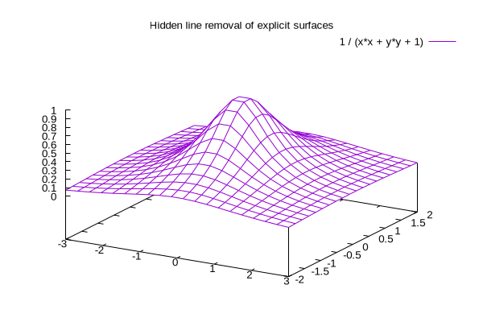

---
author: pdh
date: today
weird: [6,7,8, [9,10, {a: 1, b: 2} ], false]
stitch:
  defaults:
    cmd: "#cbx #art #cbx 1>#out 2>#err"
    ins: art:fig, cbx:fcb, out:fcb err:fcb
    log: 0
  boxes:
    arg: "-d peek -p h2v2"
  ping:
    cmd: "ping -c 2 #arg 1>#out"
    ins: out:fcb, cbx:fcb
    inc: cbx, err:fcb, out!markdown, art:!markdown@bump
    dir: ".stitch/ping"
...

`:Open https://github.com/pandoc-ext/diagram/blob/985ff8299caf4fe0d11ce94de507765bc6eb1c10/_extensions/diagram/diagram.lua#L627`
`:Open https://codeberg.org/cdsoft/panda/src/branch/master/src/panda.lua`

# id0 markdown

```{#id0 .stitch inc="cbx:fcb out!csv"}
#! /usr/bin/env bash
# https://www.iana.org/assignments/iana-ipv4-special-registry/iana-ipv4-special-registry-1.csv
wget -q https://www.iana.org/assignments/iana-ipv4-special-registry/iana-ipv4-special-registry-1.csv -O -
```
```{#args .stitch}
#!/usr/bin/env bash
echo "0 " $0
echo "1 " $1
```

````{#mark .stitch cmd="" inc="cbx!markdown"}
# Not really a codeblock
but some (generated) markdown instead
straight in the codeblock

## But rather an included markdown doc
with multiple headings
and even an image:
{#nestid caption="nested-cappi"}

```
{#nested .stitch cmd="#cbx 1>#out" ins="out"  caption="nested-cappucino"}
#!/usr/bin/env bash
cat $0 | boxes -d peek -p h2v1
```

````

# id1 boxes

Inside this para?

```{#id1 .stitch cfg=boxes caption="id1-caption"}
#!/usr/bin/env bash
cat $0 | boxes -d peek -p h2v1
```

# id2 defaults

```{#id2 .stitch .bash nou=moe fmt=stdout caption="id2-caption"}
#!/usr/bin/env bash
cat $0 | boxes -d peek -p h2v1
```

# indented codeblock

    ```{#id3 .stitch not-shown}
    #!/usr/bin/env bash
    cat $0 | boxes -d peek -p h2v1
    ```
# fenced codeblock

````
```{#id4 .stitch not-shown}
#!/usr/bin/env bash
cat $0 | boxes -d peek -p h2v1
```
````

# quoted codeblock

> ```{#id5 .lua .stitch}
> #!/usr/bin/env bash
> cat $0 | boxes -d peek -p h2v1
> ```

# ping example

```{.stitch cfg=ping arg="google.com" cid="asdf"}
this codeblock should be ignored
it has no identifier, so files should be x-..
```


# ToDo

Test out some of these [plotting tools](https://www.linuxlinks.com/excellent-free-plotting-tools/)

`:Open https://www.linuxlinks.com/excellent-free-plotting-tools/`{#idx .stitch not-shown}

